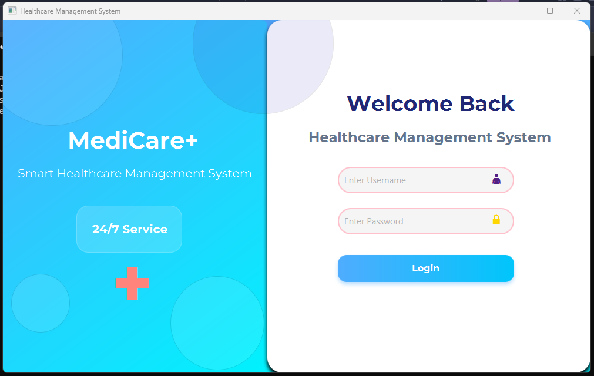
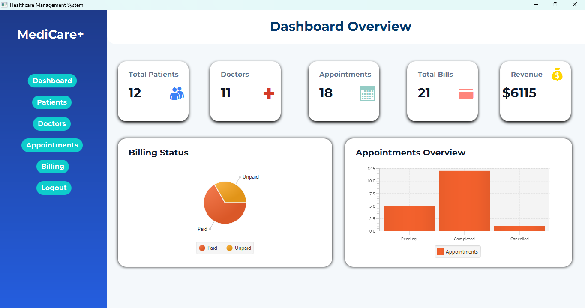
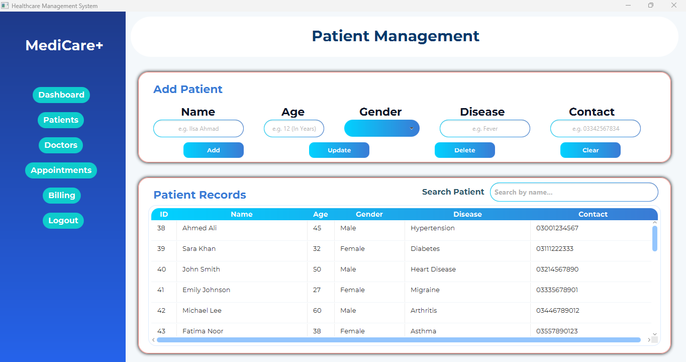
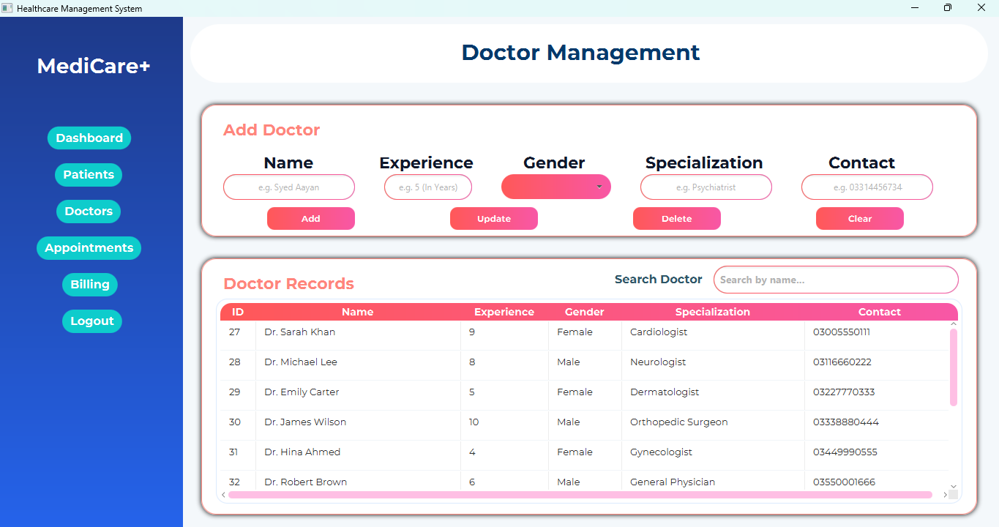
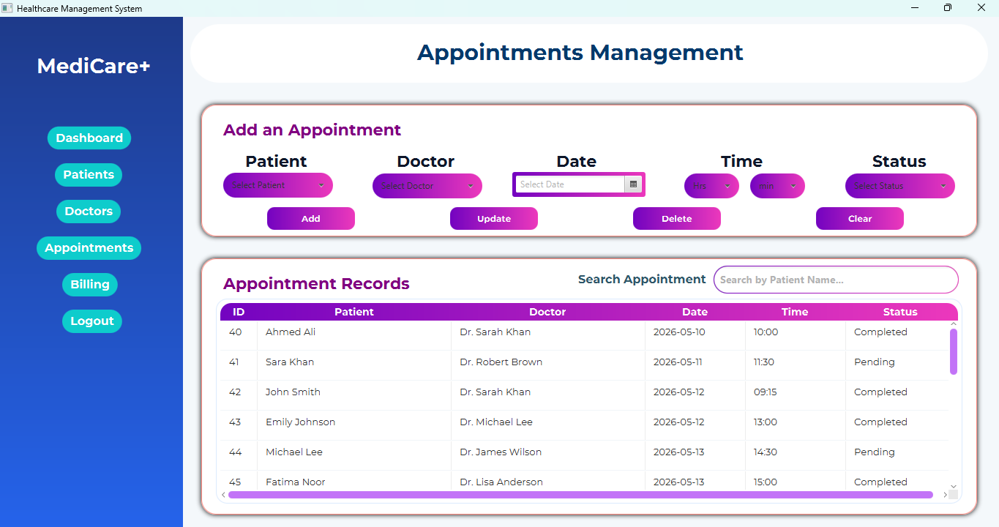
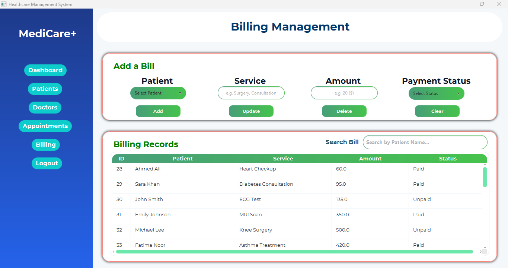

# Healthcare Management System
This is my 2nd Semester OOP Project.  
It uses Java Programming Language.  
It can be considered a Full Stack Project because it has:  
<ul>
  <li>Frontend</li>
  <li>Backend</li>
  <li>Database</li>
</ul>
 
I used the following tools for my Project:  
<ul>
  <li>VS Code</li>
  <li>Java SDK</li>
  <li>JavaFX</li>
  <li>Scene Builder</li>
  <li>PostgreSQL</li>
</ul>
 

  
  
  
  
  
  

